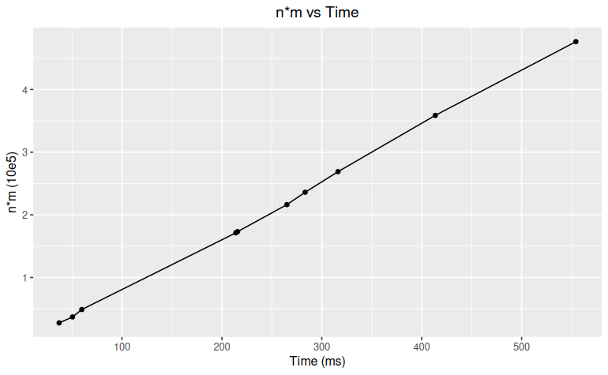

## Name

Noelio Perez (77647747)

## Assumptions:

1. You have Python3 installed.
2. Let $n$ be the length of $A$ and $m$ the length of $B$.
3. `main()` function should cover most edge cases. 

#### Instructions to Run:

1. Clone the repository

2. Navigate to project directory

3. Drop an input file in the `input/` directory (optional since you can use example input files already provided)

4. Navigate back to the project directory and then go to the `src/` directory

5. Run using the following command `python3 max_seq.py path/to/input_file` (Example: `python3 max_seq.py ../input/example1.in`)

6. To see the output file, navigate back to the project directory and then go to the `output/` directory

## Question 1: Empirical Comparison



We can see that time is directly proportional with $nm$, suggesting that the empirical running time of the algorithm is $O(nm)$. 

Note: Input files used are found in the `input/` directory as `input1.in, input2.in, ..., input10.in` and respective outputs are found in `output/` directory as `input1.out, input2.out, ..., input10.out`. 

## Question 2: Recurrence Equation

$$
\text{OPT}(i, j) = \begin{cases}
    0 & \text{ if } i = 0 \lor j = 0 \\
    \text{Val}(A_i) + OPT(i-1, j-1) & \text{ if } A_i = B_j \\
    \max \{OPT(i-1, j), OPT(i, j-1)\} & \text{ otherwise}
\end{cases}
$$

First, we consider that $OPT(i, j)$ is the max-value common subsequence of prefix strings with characters $A_1, A_2, \dots, A_i$ and $B_1, B_2, \dots, B_j$. First, base case is trivial since if either $i = 0$ or $j=0$ this implies that at least one of the prefix strings has 0 characters, which means that the max-value common subsequence is 0. Now, we consider two cases, if we have $A_i = B_j$ we can split the problem into two subproblems due to optimal substurcture of the problem for which it converts to max-value common subsequence of $A_i$ and $B_j$ plus max-value common subsequence of $A_1, A_2, \dots, A_{i-1}$ and $B_1, B_2, \dots, B_{j-1}$; however, since we said we have $A_i = B_j$, the first subproblem solution is just $\text{Val}(A_i)$ and we recurse on the second one. Lastly, if we have $A_i \ne B_j$, that means this is not a matching for the max-value common subsequence and we can split this into two subproblems, max-value common subsequence of $A_1, A_2, \dots, A_{i-1}$ and $B_1, B_2, \dots, B_j$ and max-value common subsequence of $A_1, A_2, \dots, A_{i}$ and $B_1, B_2, \dots, B_{j-1}$, for which we can take their max.

## Question 3: Big-Oh

Let `val` be a hash map for which keys are $x_1, x_2, \dots, x_K$ and values are $v_1, v_2, \dots, v_K$

```
sub_opt(K, val, A, B):
    Initialize 2D array M of size n+1 by m+1
    for i in 0, 1, ..., n:
        M[i, 0] = 0
    for j in 0, 1, ..., m:
        M[0, j] = 0
    for i in 1, 2, ..., n:
        for j in 1, 2, ..., m:
            if A_i = B_j:
                M[i, j] = val[A_i] + M[i-1, j-1]
            else:
                M[i, j] = max(M[i-1, j], M[i, j-1])
    return M[n, m]
```

The part of the algorithm with the heaviest operation is the nested for loop for which we're iterating our entire 2D array of size $n+1$ by $m+1$, therefore both the time and space complexity of the algorithm is $O(nm)$. 